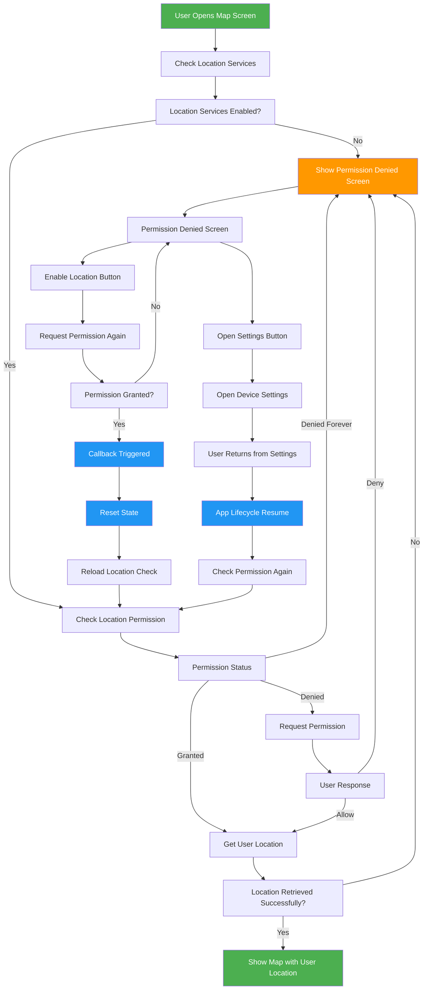

# Location Permission Fix

## Problem Identified
The app was crashing when users clicked "Enable Location Access" because:
1. **Navigation Issue**: `LocationPermissionDeniedScreen` was trying to `Navigator.pop(context)` but it was shown as a replacement screen, not a modal
2. **State Management**: No proper callback mechanism to trigger map rebuild when permission was granted
3. **Lifecycle Handling**: No handling for when users return from settings

## Solution Implemented



## Key Changes Made

### 1. Fixed Navigation Issue
**Before:**
```dart
// In LocationPermissionDeniedScreen
if (status.isGranted) {
  Navigator.pop(context); // ❌ Crashes - no navigation stack
}
```

**After:**
```dart
// In LocationPermissionDeniedScreen
if (status.isGranted) {
  widget.onPermissionGranted?.call(); // ✅ Triggers callback
}

// In MyMap widget
LocationPermissionDeniedScreen(
  onPermissionGranted: () {
    setState(() {
      _locationPermissionDenied = false;
      _isLoadingLocation = true;
    });
    _checkLocationPermissionAndGetLocation();
  },
)
```

### 2. Added Lifecycle Management
```dart
class _MyMapState extends State<MyMap> 
  with AutomaticKeepAliveClientMixin, WidgetsBindingObserver {
  
  @override
  void didChangeAppLifecycleState(AppLifecycleState state) {
    super.didChangeAppLifecycleState(state);
    // Check location permission when app resumes
    if (state == AppLifecycleState.resumed && _locationPermissionDenied) {
      _checkLocationPermissionAndGetLocation();
    }
  }
}
```

### 3. Improved Error Handling
```dart
// Added timeout and mounted checks
Position position = await Geolocator.getCurrentPosition(
  locationSettings: const LocationSettings(
    accuracy: LocationAccuracy.high,
    timeLimit: Duration(seconds: 10), // Add timeout
  ),
).timeout(
  const Duration(seconds: 15),
  onTimeout: () {
    throw Exception('Location request timed out');
  },
);

if (mounted) {
  setState(() {
    _userLocation = LatLng(position.latitude, position.longitude);
    _isLoadingLocation = false;
    _locationPermissionDenied = false;
  });
}
```

### 4. State Management Improvements
- **Callback Pattern**: Uses callback instead of navigation
- **State Reset**: Properly resets states when permission is granted
- **Mounted Checks**: Prevents setState on disposed widgets
- **Timeout Handling**: Prevents infinite loading states

## User Experience Flow (Fixed)

1. **Open Map** → Loading screen appears
2. **Permission Check** → Shows permission denied screen if needed
3. **Click "Enable Location"** → Permission request dialog appears
4. **User Allows** → Callback triggers, map reloads with location
5. **User Denies** → Stays on permission denied screen
6. **User Opens Settings** → App detects return and rechecks permission
7. **Permission Granted in Settings** → Map automatically loads with location

## Cross-Platform Compatibility

### Android
- ✅ Fixed navigation crash
- ✅ Proper permission handling
- ✅ Lifecycle management
- ✅ Settings integration

### Web
- ✅ Browser permission prompts
- ✅ HTTPS geolocation API
- ✅ No navigation stack issues
- ✅ Proper callback handling

### iOS
- ✅ Permission dialogs
- ✅ Settings navigation
- ✅ Lifecycle management
- ✅ Privacy compliance

## Testing Scenarios

### ✅ Working Scenarios
1. **First Time**: User grants permission → Map loads with location
2. **Permission Denied**: User denies → Shows blocking screen
3. **Settings Change**: User enables in settings → Map auto-reloads
4. **Web Browser**: Browser permission prompt → Map loads correctly
5. **App Resume**: Return from settings → Permission rechecked

### ❌ Previously Broken Scenarios (Now Fixed)
1. **Android Crash**: Click "Enable Location" → Now works correctly
2. **Web Crash**: Allow browser permission → Now works correctly
3. **Navigation Error**: No more `Navigator.pop()` crashes
4. **State Issues**: Proper state management prevents crashes

## Technical Benefits

1. **Robust Error Handling**: Timeouts and mounted checks prevent crashes
2. **Proper State Management**: Clear state transitions and callbacks
3. **Lifecycle Awareness**: Handles app backgrounding/foregrounding
4. **Cross-Platform**: Works consistently across Android, iOS, and Web
5. **User-Friendly**: Clear feedback and smooth transitions

