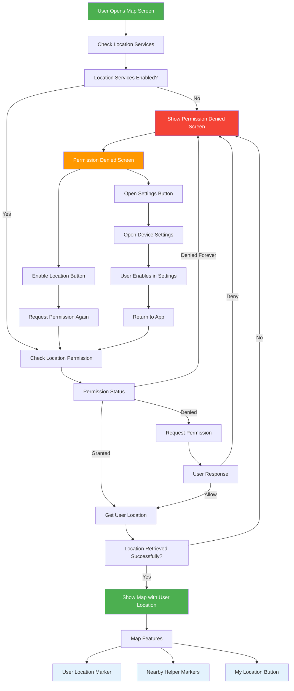

# Location Permission Flow

## Implementation Details

### 1. Location Permission Handling
- **Service Check**: Verifies if location services are enabled on the device
- **Permission Check**: Checks current location permission status
- **Permission Request**: Requests location permission if not granted
- **Fallback**: Shows permission denied screen if access is permanently denied

### 2. User Location Detection
- **High Accuracy**: Uses `LocationAccuracy.high` for precise location
- **Error Handling**: Graceful fallback if location retrieval fails
- **Map Centering**: Automatically centers map on user's location
- **Zoom Level**: Sets appropriate zoom level (15.0 for user location)

### 3. Map Features
- **User Location Marker**: Blue circle with location icon showing user's position
- **My Location Button**: Floating action button to re-center map on user
- **Nearby Helpers**: Red markers showing other users who can help
- **Interactive Popups**: Tap markers to see user details

### 4. Permission Denied Screen
- **Clear Explanation**: Explains why location access is needed
- **Benefits List**: Shows advantages of enabling location
- **Action Buttons**: Direct access to enable location or open settings
- **User-Friendly**: Professional design with clear call-to-action

### 5. Loading States
- **Loading Screen**: Shows while getting user location
- **Progress Indicator**: Visual feedback during location retrieval
- **Status Messages**: Clear communication about what's happening

## User Experience Flow

1. **Open Map** → Loading screen appears
2. **Location Check** → Permission request if needed
3. **Permission Granted** → Map shows with user location
4. **Permission Denied** → Blocking screen with options
5. **Enable Location** → Return to map with full functionality

## Technical Implementation

### Dependencies Added
- `geolocator: ^14.0.2` - Location services
- `latlong2: ^0.9.1` - Geographic coordinates
- `permission_handler: ^12.0.1` - Permission management (already present)

### Key Methods
- `_checkLocationPermissionAndGetLocation()` - Main location logic
- `_requestLocationPermission()` - Permission handling
- `_openAppSettings()` - Settings navigation

### State Management
- `_userLocation` - Current user coordinates
- `_isLoadingLocation` - Loading state
- `_locationPermissionDenied` - Permission status

## Cross-Platform Support

### Android
- Requires location permissions in `AndroidManifest.xml`
- Handles runtime permission requests
- Supports background location (if needed)

### iOS
- Requires location usage descriptions in `Info.plist`
- Handles permission dialogs
- Supports different accuracy levels

### Web
- Uses browser's geolocation API
- Handles HTTPS requirements
- Supports permission prompts

